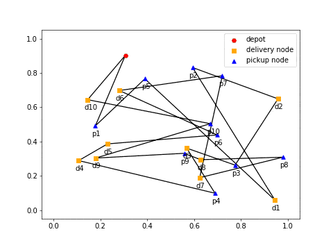
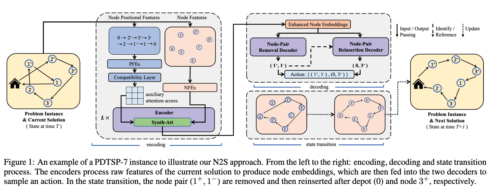

# PDP-N2S
N2S is a learning based improvement framework for solving the pickup and delivery problems, a.k.a. PDPs (e.g., PDTSP and PDTSP-LIFO).
It explores 3 advances on the top of [DACT](https://github.com/yining043/VRP-DACT):
- Synthesis Attention (Synth-Att), which achieves slightly better performance while largely reducing computational costs of DAC-Att in DACT
- two customized decoders, which learns to perform removal and reinsertion of a pickup-delivery node pair to tackle the precedence constraint
- a diversity enhancement scheme, which further ameliorates the performance



# Paper


This repo implements our paper: Yining Ma, Jingwen Li, Zhiguang Cao, Wen Song, Hongliang Guo, Yuejiao Gong and Yeow Meng Chee, “[Efficient Neural Neighborhood Search for Pickup and Delivery Problems](https://arxiv.org/abs/xxxxx),” in the 31st International Joint Conference on Artificial Intelligence and the 25th European Conference on Artificial Intelligence (IJCAI-ECAI 22), 2022.

Please cite our paper if the code is useful for your project.
```
@inproceedings{ma2022efficient,
  title = {Efficient Neural Neighborhood Search for Pickup and Delivery Problems},
  author = {Yining Ma and Jingwen Li and Zhiguang Cao and Wen Song and Hongliang Guo and Yuejiao Gong and Yeow Meng Chee},
  booktitle = {Proceedings of the Twenty-Seventh International Joint Conference on Artificial Intelligence, {IJCAI-22}},
  publisher = {International Joint Conferences on Artificial Intelligence Organization},
  year = {2022},
}
```


# Dependencies
* Python>=3.6
* PyTorch>=1.1
* numpy
* tensorboard_logger
* tqdm
* cv2
* matplotlib

### Note:
For the exception below from package tensorboard_logger,
```python
AttributeError: module 'scipy.misc' has no attribute 'toimage'
```
Please refer to [issue #27](https://github.com/TeamHG-Memex/tensorboard_logger/issues/27) to fix it.


# Usage
## Generating data
Training data is generated on the fly. Please follow repo [Demon0312/Heterogeneous-Attentions-PDP-DRL](https://github.com/Demon0312/Heterogeneous-Attentions-PDP-DRL) to generate validating or test data if needed. We also provide some randomly generated data in the  [datasets](./datasets) folder.

## Training
### PDTSP examples
20 nodes:
```python
CUDA_VISIBLE_DEVICES=0 python run.py --problem pdtsp --graph_size 20 --warm_up 2 --max_grad_norm 0.05 --val_m 1 --val_dataset './datasets/pdp_20.pkl' --run_name 'example_training_PDTSP20'
```

50 nodes:
```python
CUDA_VISIBLE_DEVICES=0,1 python run.py --problem pdtsp --graph_size 50 --warm_up 1.5 --max_grad_norm 0.15 --val_m 1 --val_dataset './datasets/pdp_50.pkl' --run_name 'example_training_PDTSP50'
```

100 nodes:
```python
CUDA_VISIBLE_DEVICES=0,1,2,3 python run.py --problem pdtsp --graph_size 100 --warm_up 1 --max_grad_norm 0.35 --val_m 1 --val_dataset './datasets/pdp_100.pkl' --run_name 'example_training_PDTSP100'
```
### PDTSP-LIFO examples
20 nodes:
```python
CUDA_VISIBLE_DEVICES=0 python run.py --problem pdtspl --graph_size 20 --warm_up 2 --max_grad_norm 0.05 --val_m 1 --val_dataset './datasets/pdp_20.pkl' --run_name 'example_training_PDTSPL20'
```

50 nodes:
```python
CUDA_VISIBLE_DEVICES=0,1 python run.py --problem pdtspl --graph_size 50 --warm_up 1.5 --max_grad_norm 0.15 --val_m 1 --val_dataset './datasets/pdp_50.pkl' --run_name 'example_training_PDTSPL50'
```

100 nodes:
```python
CUDA_VISIBLE_DEVICES=0,1,2,3 python run.py --problem pdtspl --graph_size 100 --warm_up 1 --max_grad_norm 0.35 --val_m 1 --val_dataset './datasets/pdp_100.pkl' --run_name 'example_training_PDTSPL100'
```

### Warm start
You can initialize a run using a pretrained model by adding the --load_path option:
```python
--load_path '{add model to load here}'
```
### Resume Traning
You can resume a training by adding the --resume option:
```python
--resume '{add last saved checkpoint(model) to resume here}'
```
The Tensorboard logs will be saved to folder "logs" and the trained model (checkpoint) will be saved to folder "outputs". Pretrained models are provided in the [pre-trained](./pre-trained) folders.

## Inference
Load the model and specify the iteration T for inference (using --val_m for data augments):

```python
--eval_only 
--load_path '{add model to load here}'
--T_max 3000 
--val_size 2000 
--val_batch_size 200 
--val_dataset '{add dataset here}' 
--val_m 50
```

### Examples
For inference 2,000 PDTSP instances with 100 nodes and no data augment (N2S):
```python
CUDA_VISIBLE_DEVICES=0,1,2,3,4,5,6,7 python run.py --eval_only --no_saving --no_tb --problem pdtsp --graph_size 100 --val_m 1 --val_dataset './datasets/pdp_100.pkl' --load_path 'pre-trained/pdtsp/100/epoch-195.pt' --val_size 2000 --val_batch_size 2000 --T_max 3000
```
For inference 2,000 PDTSP instances with 100 nodes using the augments in Algorithm 2 (N2S-A):
```python
CUDA_VISIBLE_DEVICES=0,1,2,3,4,5,6,7 python run.py --eval_only --no_saving --no_tb --problem pdtsp --graph_size 100 --val_m 50 --val_dataset './datasets/pdp_100.pkl' --load_path 'pre-trained/pdtsp/100/epoch-195.pt' --val_size 2000 --val_batch_size 200 --T_max 3000
```
See [options.py](./options.py) for detailed help on the meaning of each argument.

# Acknowledgements
The code and the framework are based on the repos [yining043/VRP-DACT](https://github.com/yining043/VRP-DACT).
